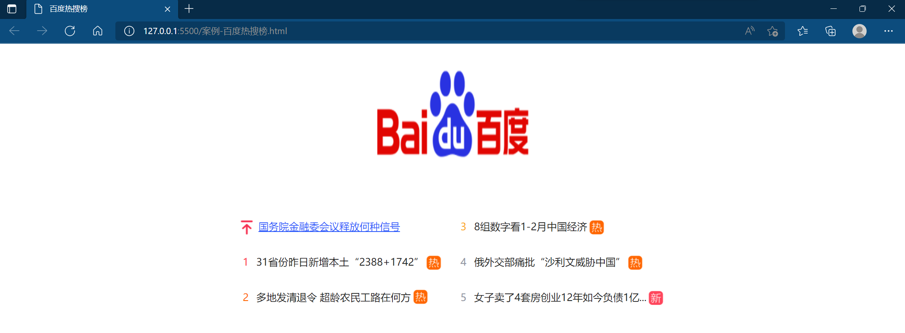

# 个人周报

任赫楠  202112575

## 本周工作

1. 学习了css 背景样式、复合选择器、及包含css3的一些伪类选择器
2. 继续观看视频学习Java
3. 制作一些简单的页面

## 本周遇到的技术困难及解决方案

1. 做网页案例时发现很多父级元素样式会影响子元素样式

+ 解决方案：查找百度得知，原来css含有继承特性

## 下周安排

1. 继续学习css，争取在两周内学完它

2. 备考六级和计算机二级

## 成果展示

* 自己模仿百度首页写了一个热搜榜，截图如下：

