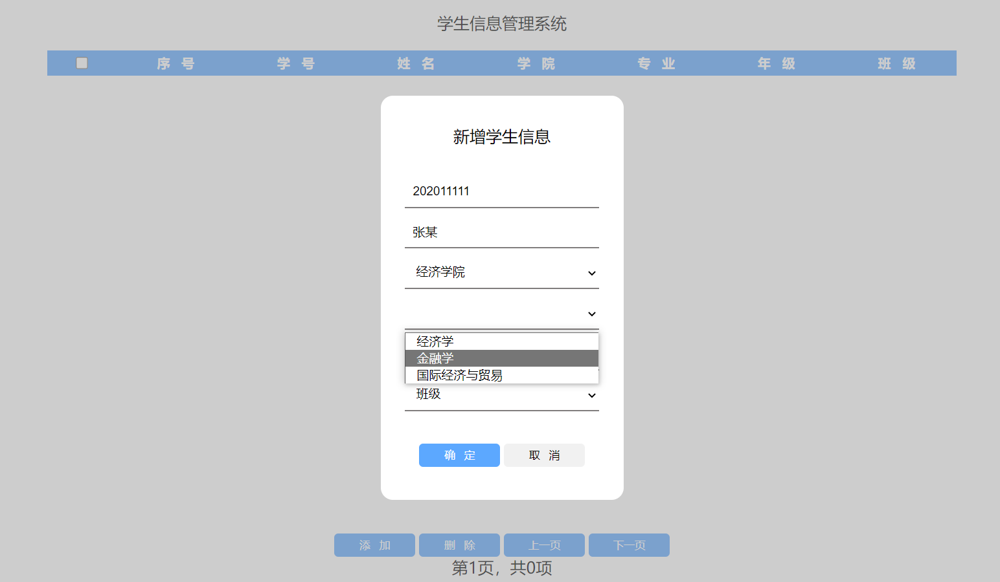

## 个人周报

卓金玉 202011146

##### 本周工作：

1. 复习html/css/javascript/jquery

##### 本周遇到的技术困难及解决方案：

1. 问题：vscode无法导入c4p0 jar包

   解决方案：暂未解决，改用idea练习

##### 下周安排：

1. JavaWeb 201~300，学习xml，tomcat以及servlet

##### 成果展示：

