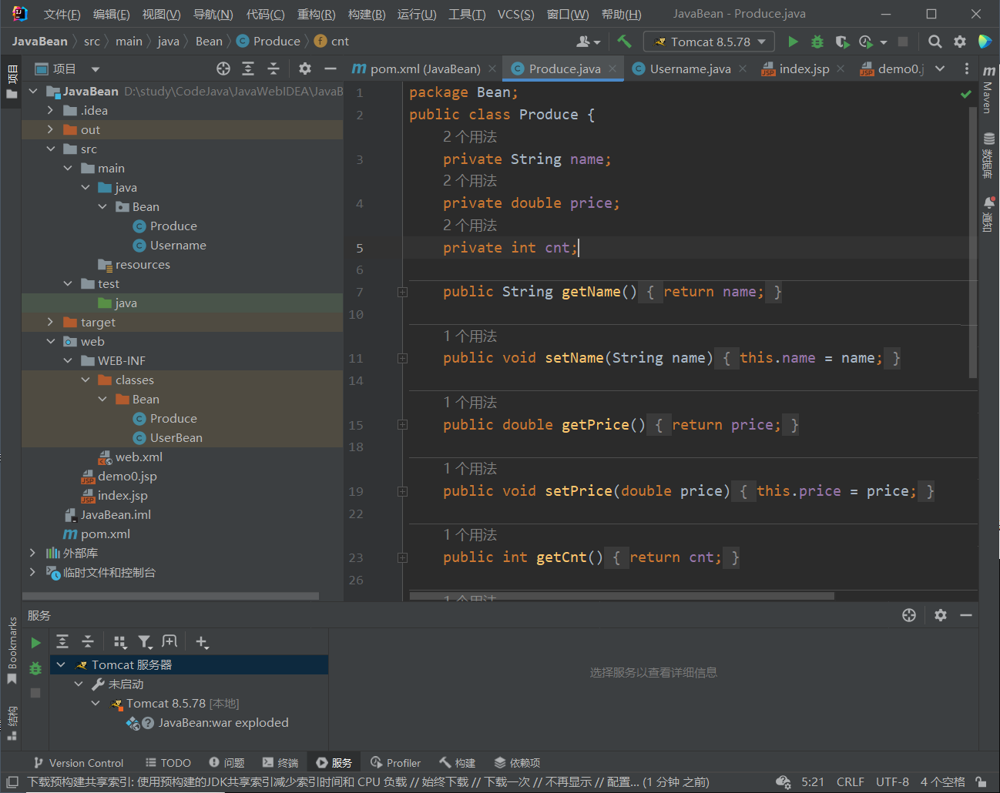

## 个人周报

卓金玉 202011146

##### 本周工作：

1. 学习xml、servlet、JSP等知识，学习tomcat的使用

##### 本周遇到的技术困难及解决方案：

1. 问题：tomcat无法找到jsp网页

   解决方案：在项目结构->模块->路径中更改输出目录

##### 下周安排：

1. JavaWeb 301~400，学习EL表达式、JSTL标签、三层架构以及JQuery

##### 博客链接：

https://blog.csdn.net/Cu_prum/article/details/124239430

##### 成果展示：

