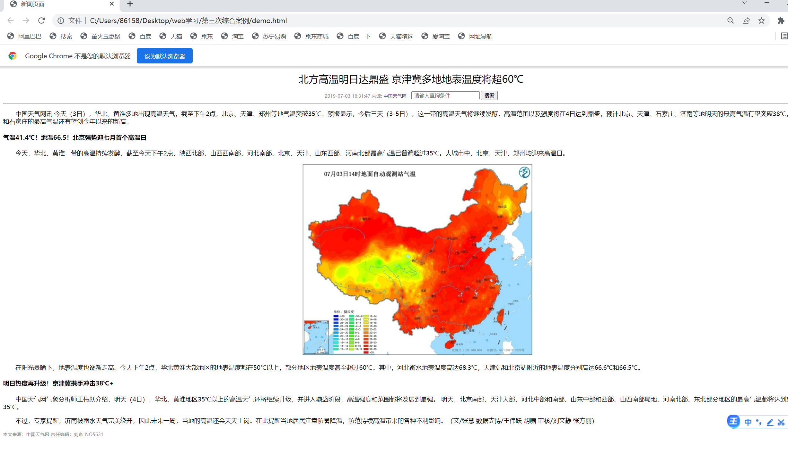
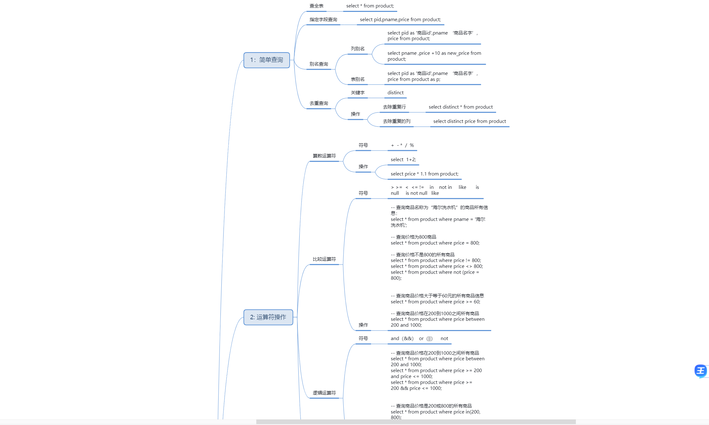

### 个人周报

##### 本周工作:

1.确定分流工作2

2.写一些大型网页

3.学习Java

##### 本周遇到的技术困难及解决方案：

1.并未遇见困难;

##### 下周安排:

1.加强算法学习;

2.学习java;

3.学习MySQL

##### 成果展示:

用html和css做的网页

####  HTML代码

```html
<!DOCTYPE html>
<html lang="en">

<head>
    <meta charset="UTF-8">
    <meta name="viewport" content="width=device-width, initial-scale=1.0">
    <title>学成在线官方网页</title>
    <link rel="stylesheet" href="demo.css">
</head>

<body>
    <div class="header w">
        <div class="logo">
            
        </div>
        <div class="nav">
            <ul>
                <li><a href="#">首页</a></li>
                <li><a href="#">课程</a></li>
                <li><a href="#">课程规划</a></li>
            </ul>
        </div>
        <div class="search">
            <input type="text" value="请输入关键词">
            <button></button>
        </div>

        <div class="person">
            
        </div>
    </div>

    <div class="banner">
        <div class="w">
            <div class="list">
                <ul>
                    <li><a href="#">前端开发<span>&gt;</span></a></li>
                    <li><a href="#">后端开发<span>&gt;</span></a></li>
                    <li><a href="#">移动开发<span>&gt;</span></a></li>
                    <li><a href="#">人工智能<span>&gt;</span></a></li>
                    <li><a href="#">商业预测<span>&gt;</span></a></li>
                    <li><a href="#">云计算&大数据<span>&gt;</span></a></li>
                    <li><a href="#">运维&从测试<span>&gt;</span></a></li>
                    <li><a href="#">UI设计<span>&gt;</span></a></li>
                    <li><a href="#">产品<span>&gt;</span></a></li>
                </ul>
            </div>
            <div class="course">
                <div class="text">
                    <p>此刻有<span>1324649</span>小伙伴在学习</p>
                </div>
                <div class="h">
                    <p>你还在等什么?</p>
                </div>
                <div class="pic">
                    
                </div>
                <div class="ft">
                    <input type="submit" value="登录">
                </div>
            </div>
        </div>
    </div>
    <div class="goods w">
        <h3>精品推荐</h3>
        <ul>
            <li><a href="#">JQuery</a></li>
            <li><a href="#">Spark</a></li>
            <li><a href="#">MySQL</a></li>
            <li><a href="#">JavaWeb</a></li>
            <li><a href="#">MySQL</a></li>
            <li><a href="#">JavaWeb</a></li>
        </ul>
        <a href="#" class="mod">修改兴趣</a>
    </div>
    <div class="gd w">
        <h2>精品推荐</h2>
        <a href="#">查看全部</a>
    </div>
    <div class="bd w">
        <ul class="clearfix">
            <li>
                
                <h4>Think PHP 5.0 博客系统实战项目演练 </h4>
                <div class="info"><span>高级</span> • 1125人在学习</div>
            </li>
            <li>
                
                <h4>Android 网络图片加载框架详解
                </h4>
                <div class="info"><span>高级</span> • 1125人在学习</div>
            </li>
            <li>
                
                <h4>Angular 2 最新框架+主流技术+项目实战 </h4>
                <div class="info"><span>高级</span> • 1125人在学习</div>

            </li>
            <li>
                
                <h4>Android Hybrid APP开发实战 H5+原生！</h4>
                <div class="info"><span>高级</span> • 1125人在学习</div>
            </li>
            <li>
                
                <h4>Android Hybrid APP开发实战 H5+原生！ </h4>
                <div class="info"><span>高级</span> • 1125人在学习</div>
            </li>
            <li>
                
                <h4>Think PHP 5.0 博客系统实战项目演练 </h4>
                <div class="info"><span>高级</span> • 1125人在学习</div>
            </li>
            <li>
                
                <h4>Android 网络图片加载框架详解
                </h4>
                <div class="info"><span>高级</span> • 1125人在学习</div>
            </li>
            <li>
                
                <h4>Angular 2 最新框架+主流技术+项目实战 </h4>
                <div class="info"><span>高级</span> • 1125人在学习</div>

            </li>
            <li>
                
                <h4>Android Hybrid APP开发实战 H5+原生！</h4>
                <div class="info"><span>高级</span> • 1125人在学习</div>
            </li>
            <li>
                
                <h4>Android Hybrid APP开发实战 H5+原生！ </h4>
                <div class="info"><span>高级</span> • 1125人在学习</div>
            </li>
        </ul>
    </div>
    <div class="footer">
        <div class="w">
            <div class="copyright">
                
                <p>学成在线致力于普及中国最好的教育它与中国一流大学和机构合作提供在线课程。<br>
                    © 2017年XTCG Inc.保留所有权利。-沪ICP备15025210号</p>
                <a href="#" class="app">下载APP</a>
            </div>
            <div class="links">

                <dl>
                    <dt>关于学成网</dt>
                    <dd>
                        <a href="#">关于</a>
                    </dd>
                    <dd><a href="#">管理团队</a></dd>
                    <dd><a href="#">工作计划</a></dd>
                    <dd><a href="#">客服帮助</a></dd>
                    <dd><a href="#">帮助</a></dd>

                </dl>
                <dl>
                    <dt>关于学成网</dt>
                    <dd>
                        <a href="#">关于</a>
                    </dd>
                    <dd><a href="#">管理团队</a></dd>
                    <dd><a href="#">工作计划</a></dd>
                    <dd><a href="#">客服帮助</a></dd>
                    <dd><a href="#">帮助</a></dd>

                </dl>
                <dl>
                    <dt>关于学成网</dt>
                    <dd>
                        <a href="#">关于</a>
                    </dd>
                    <dd><a href="#">管理团队</a></dd>
                    <dd><a href="#">工作计划</a></dd>
                    <dd><a href="#">客服帮助</a></dd>
                    <dd><a href="#">帮助</a></dd>

                </dl>
            </div>

        </div>
    </div>

</body>

</html>
```

#### css代码

```css
* {
    margin: 0px;
    padding: 0px;
}
body {
    background-color: #f3f5f7;
}

.w{
    width: 1200px;
    margin: auto;
}

.header {
    height: 40px;
    margin: 30px auto;
    
}

.logo {
    height: 40px;
    float: left;
    width: 196px;
    margin-right: 35px;
}
li {
    list-style: none;
}
a {
    text-decoration: none;
}
.clearfix:before,.clearfix::after {
    content: "";
    display: table;
}
.clearfix:after {
    clear: both;
}
.clearfix {
    *zoom: 1;
}

.nav {
    float: left;
}
.nav ul li {
    float: left;
    margin-left: 38px;
}

.nav ul li a {
    display: block;
    height: 40px;
    padding: 0 10px;
    font-size: 18px;
    color: #050505;
    line-height: 40px;
}

.nav ul li a:hover {
border-bottom: 1px solid #00a4ff;
}

.search {
    height: 40px;
    background-color: #00a4ff;
    float: left;
    width: 412px;
    margin-left: 95px;
}
.search input {
    width:361px;
    height: 38px;
    border: 1px solid #00a4ff;
    border-right: 0;
    text-indent: 1.5em;
    font-size: 14px;
    color: #bfbfbf;
    float: left;
}
.search button {
    width: 50px;
    height: 40px;
    float: left;
    border: 0;
    background-image: url(images/fa-search.png);


}

.person  {
    float: right;
    margin:0 10px;
    line-height: 40px;
}

.banner {
    height: 420px;
    background-color: #1c036c;
}
.banner .w {
    height: 420px;
    background:url(images/banner2.png) no-repeat top center
}

.list {
    height: 420px;
    width: 191px;
    float: left;
    background: rgba(0,0,0,.3);
}
.list ul li {
    margin-top: 25px;
    font-size: 14px;
    color: #ffffff;
}

.list ul li a {
    color: #ffffff;
    padding-left: 23px;

}

.list ul li a span {
    float: right;
    margin-right: 20px;
}

.list ul li a:hover {
    color: #00b4ff;
}

.course {
    float: right;
    width: 228px;
    height: 300px;
    margin-top: 51px;
    background-color: #fff;

}
.course .text {
    margin-top: 35px;
}
.course p {
    text-align: center;
    font-size: 12px;
    color: #666666;
}
.course span {
    font-weight: 700;
    color: #ff7c2d;
    font-size: 16px;

}
.course .h p {
    margin-top: 22px;
    text-align: center;
    font-size: 16px;
    color: #666666;
}
.course .pic {
    margin:32px 0 0 82px;
} 

.course .ft {
    margin: 20px 15px;
    
}
.course .ft input {
    width: 200px;
    height: 40px;
    background-color: #00a4ff;
    text-align: center;
    font-size: 18px;
    color: #fff;
    border: 0;
}

.goods {
    height: 60px;
    background-color: #fff;
    box-shadow:0 2px 3px 3px rgba(0,0,0,.1) ;
    line-height: 60px;
}
.goods h3 {
    float: left;
    margin-left: 30px;
    margin-right: 30px;
    font-size: 16px;
    color: #00a4ff;
}

.goods ul {
    float: left;
    
}

.goods ul li {
    float: left;
    
}
.mod {
    float: right;
    font-size: 14px;
    color: #00a4ff;
    padding-right: 26px;
}

.goods ul li a {
    padding: 0 33px;
    font-size: 16px;
    color: #050505;
 border-left: 1px solid #bfbfbf;
}

.goods ul li a:hover {
    color: #00a4ff;
    border-bottom: 1px solid #00a4ff;
}

.gd {
    height: 43px;
    margin-top: 34px;
}
.gd h2 {
    font-size: 20px;
    color: #494949;
    float: left;
    font-weight: 400;
}
.gd a {
    float: right;
    font-size: 14px;
    color: #00a4ff;
    line-height: 43px;
    margin-right: 30px;
}
.bd {
    width: 1200px;
}

.bd ul li {
    float: left;
    width: 228px;
    height: 270px;
   background-color: #fff;
    margin-right: 15px;
    margin-bottom: 15px;
}

.bd ul {
    width: 1225px;
}


.bd ul li h4 {
    font-size: 14px;
    color: #050505;
    font-weight: 400;
    margin: 20px 20px 20px 25px;
}
.bd ul li .info {
    font-size: 12px;
    color: #999999;
    margin: 0 20px 0 25px;
}
.bd ul li .info span {
    color: orange;
}
.footer {
    height: 415px;
    background-color: #fff;
}
.footer .w {
    padding-top: 35px;
}
.footer .copyright {
    float: left;
}
.links {
    float: right;
}
.copyright p {
    font-size: 12px;
    color: #666666;
    margin: 20px 0 15px 0;
}
.footer .copyright .app {
    width: 118px;
    height: 33px;
    border: 1px solid #00a4ff;
    text-align: center;
    line-height: 33px;
    color: #00a4ff;
    font-size: 16px;
    display: inline-block;
}
.links dl {
    float: left;
    margin-left: 100px;
}
.links dl dt {
    font-size: 16px;
    color: #333333;
    margin-bottom: 5px;
}
.links dl dd a {
    color: #333;
    font-size: 12px;
}
```

#### 效果图


