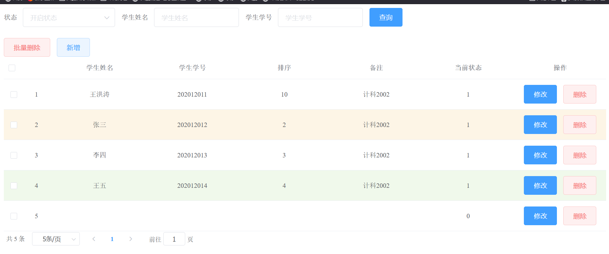

# 个人周报

王洪涛 202012011

---
## 本周工作

1.继续深入学习java

2.学习javaweb中Servlet、会话技术，了解request和response、Filter等技术

3.通过javaweb和mysql制作了一个管理系统

---
## 本周遇到的技术困难及解决方案
Tomcat启动显示成功但是没有生成访问链接

解决方案：在pom.xml文件中没有配置生成war包，配置生成war包 

    <packaging>war</packaging>
---
## 下周安排

1.继续深入学习java

2.学习MVC架构

3.学习spring全家桶

---
## 成果展示
[javaWeb](https://19460.github.io/2022/04/07/JavaWeb/?t=1649601990881)

[java学习日记](https://19460.github.io/2022/03/20/java%E5%AD%A6%E4%B9%A0%E6%97%A5%E8%AE%B0/)

